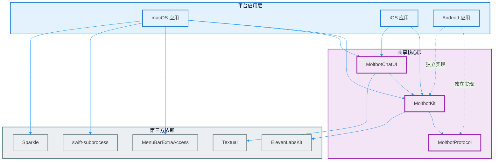
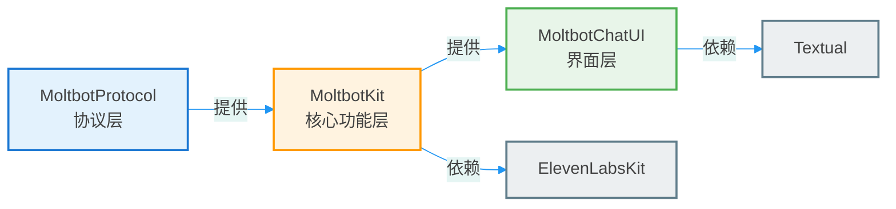
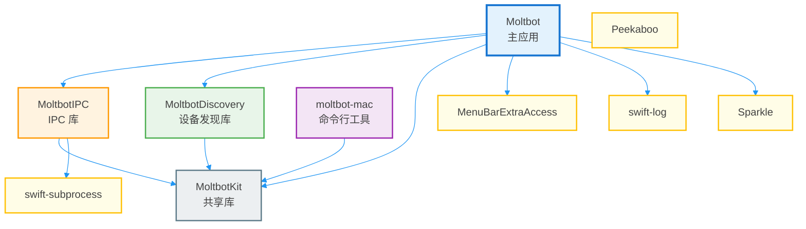
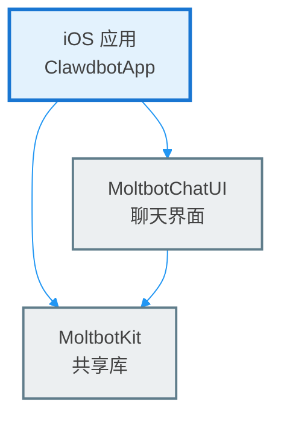
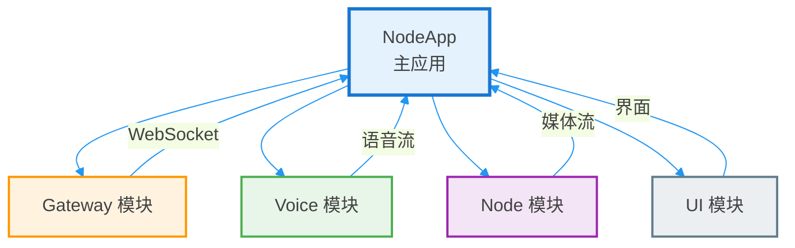

# Apps 模块依赖关系图

> 生成时间：2026-02-26
> 分析范围：`/home/pps/moltbot/apps` 目录
> 分析工具：Code Analyzer

---

## 目录

- [1. 项目概述](#1-项目概述)
- [2. 架构设计](#2-架构设计)
- [3. 子项目说明](#3-子项目说明)
- [4. 依赖关系分析](#4-依赖关系分析)
- [5. 技术栈对比](#5-技术栈对比)
- [6. 架构洞察](#6-架构洞察)
- [7. 模块索引](#7-模块索引)

---

## 1. 项目概述

### 1.1 项目简介

`apps` 目录包含 Moltbot 的多平台客户端应用，采用跨平台架构设计，支持 macOS、iOS 和 Android 三个主要平台。项目通过共享核心库（MoltbotKit）实现代码复用，同时针对各平台特性进行优化。

### 1.2 项目规模

| 指标 | 数值 |
|------|------|
| 子项目数量 | 4 |
| 平台数量 | 3 |
| 源代码文件 | 200+ |
| Swift 文件 | 150+ |
| Kotlin 文件 | 50+ |
| 共享库模块 | 3 |
| 第三方依赖 | 10+ |

### 1.3 技术架构

```
apps/
├── shared/MoltbotKit/    # 共享核心库（Swift）
│   ├── MoltbotProtocol   # 协议定义
│   ├── MoltbotKit        # 核心功能
│   └── MoltbotChatUI     # 聊天界面
├── macos/                # macOS 应用
├── ios/                  # iOS 应用
└── android/              # Android 应用
```

---

## 2. 架构设计

### 2.1 整体架构图



### 2.2 共享库架构



### 2.3 macOS 应用架构



### 2.4 iOS 应用架构



### 2.5 Android 应用架构



---

## 3. 子项目说明

### 3.1 共享库（MoltbotKit）

#### 3.1.1 MoltbotProtocol

**职责**：定义 Gateway 通信协议和数据模型

**核心文件**：
- `GatewayModels.swift` - Gateway 数据模型
- `GatewayChannel.swift` - Gateway 通道定义
- `GatewayNodeSession.swift` - Gateway 会话管理
- `GatewayErrors.swift` - 错误定义
- `AnyCodable.swift` - 通用编码解码器

**依赖**：无（基础协议层）

#### 3.1.2 MoltbotKit

**职责**：提供核心功能实现

**核心功能模块**：
- **Gateway 通信**
  - `GatewayNodeSession.swift` - Gateway 会话管理
  - `GatewayTLSPinning.swift` - TLS 证书固定
  - `GatewayPush.swift` - Gateway 推送处理
  - `GatewayPayloadDecoding.swift` - 负载解码

- **设备管理**
  - `DeviceIdentity.swift` - 设备身份
  - `DeviceAuthStore.swift` - 设备认证存储
  - `InstanceIdentity.swift` - 实例身份

- **语音功能**
  - `TalkSystemSpeechSynthesizer.swift` - 系统语音合成
  - `TalkPromptBuilder.swift` - 语音提示构建器
  - `TalkDirective.swift` - 语音指令
  - `ElevenLabsKitShim.swift` - ElevenLabs 集成

- **Canvas 功能**
  - `CanvasA2UICommands.swift` - Canvas A2UI 命令
  - `CanvasA2UIAction.swift` - Canvas A2UI 动作
  - `CanvasA2UIJSONL.swift` - Canvas JSONL 处理
  - `CanvasCommands.swift` - Canvas 命令

- **其他功能**
  - `LocationSettings.swift` - 位置设置
  - `CameraCommands.swift` - 相机命令
  - `ScreenCommands.swift` - 屏幕命令
  - `BonjourEscapes.swift` - Bonjour 服务发现
  - `DeepLinks.swift` - 深度链接处理

**依赖**：
- MoltbotProtocol
- ElevenLabsKit（语音合成）

#### 3.1.3 MoltbotChatUI

**职责**：提供聊天界面组件

**核心组件**：
- `ChatView.swift` - 聊天主视图
- `ChatViewModel.swift` - 聊天视图模型
- `ChatTransport.swift` - 聊天传输层
- `ChatTheme.swift` - 聊天主题
- `ChatSheets.swift` - 聊天表单
- `ChatSessions.swift` - 聊天会话管理
- `ChatModels.swift` - 聊天数据模型
- `ChatMessageViews.swift` - 聊天消息视图
- `ChatMarkdownRenderer.swift` - Markdown 渲染器
- `ChatMarkdownPreprocessor.swift` - Markdown 预处理器
- `ChatComposer.swift` - 聊天编辑器
- `AssistantTextParser.swift` - 助手文本解析器

**依赖**：
- MoltbotKit
- Textual（文本处理，仅 macOS/iOS）

### 3.2 macOS 应用

#### 3.2.1 MoltbotIPC

**职责**：提供进程间通信能力

**核心功能**：
- 进程间消息传递
- 服务发现
- 状态同步

**依赖**：
- MoltbotKit
- swift-subprocess（子进程管理）

#### 3.2.2 MoltbotDiscovery

**职责**：设备发现和连接管理

**核心功能**：
- Bonjour 服务发现
- Gateway 自动发现
- 设备配对管理

**依赖**：
- MoltbotKit

#### 3.2.3 Moltbot（主应用）

**职责**：macOS 菜单栏应用

**核心功能**：
- 菜单栏界面
- Gateway 连接管理
- 语音唤醒
- 聊天界面
- 设置管理
- 自动更新

**依赖**：
- MoltbotIPC
- MoltbotDiscovery
- MoltbotKit
- MoltbotChatUI
- MenuBarExtraAccess（菜单栏额外访问）
- swift-log（日志）
- Sparkle（自动更新）

#### 3.2.4 moltbot-mac（命令行工具）

**职责**：macOS 命令行接口

**核心功能**：
- 命令行参数解析
- Gateway 管理
- 配置管理

**依赖**：
- MoltbotKit

### 3.3 iOS 应用

#### 3.3.1 应用结构

**主要模块**：

- **Gateway 模块**
  - `GatewayConnectionController.swift` - Gateway 连接控制
  - `GatewayDiscoveryModel.swift` - Gateway 发现模型
  - `GatewaySettingsStore.swift` - Gateway 设置存储
  - `KeychainStore.swift` - Keychain 存储
  - `IOSGatewayChatTransport.swift` - iOS Gateway 聊天传输

- **Chat 模块**
  - `ChatSheet.swift` - 聊天表单

- **Voice 模块**
  - `VoiceWakeManager.swift` - 语音唤醒管理器
  - `VoiceWakePreferences.swift` - 语音唤醒偏好设置
  - `TalkModeManager.swift` - 语音模式管理器
  - `TalkOrbOverlay.swift` - 语音球覆盖层

- **Screen 模块**
  - `ScreenController.swift` - 屏幕控制器
  - `ScreenRecordService.swift` - 屏幕录制服务
  - `ScreenWebView.swift` - 屏幕 WebView
  - `ScreenTab.swift` - 屏幕标签页

- **Camera 模块**
  - `CameraController.swift` - 相机控制器

- **Location 模块**
  - `LocationService.swift` - 位置服务

- **Settings 模块**
  - `SettingsTab.swift` - 设置标签页
  - `VoiceWakeWordsSettingsView.swift` - 语音唤醒词设置视图
  - `SettingsNetworkingHelpers.swift` - 设置网络辅助工具

**依赖**：
- MoltbotKit
- MoltbotChatUI

### 3.4 Android 应用

#### 3.4.1 应用结构

**主要模块**：

- **Gateway 模块**
  - `GatewayProtocol.kt` - Gateway 协议
  - `GatewaySession.kt` - Gateway 会话
  - `GatewayDiscovery.kt` - Gateway 发现
  - `GatewayEndpoint.kt` - Gateway 端点
  - `GatewayTls.kt` - Gateway TLS
  - `DeviceAuthStore.kt` - 设备认证存储
  - `DeviceIdentityStore.kt` - 设备身份存储
  - `BonjourEscapes.kt` - Bonjour 转义

- **Voice 模块**
  - `VoiceWakeManager.kt` - 语音唤醒管理器
  - `TalkModeManager.kt` - 语音模式管理器
  - `TalkDirectiveParser.kt` - 语音指令解析器
  - `VoiceWakeCommandExtractor.kt` - 语音唤醒命令提取器
  - `StreamingMediaDataSource.kt` - 流媒体数据源

- **Chat 模块**
  - `ChatController.kt` - 聊天控制器
  - `ChatModels.kt` - 聊天模型

- **Node 模块**
  - `CameraCaptureManager.kt` - 相机捕获管理器
  - `ScreenRecordManager.kt` - 屏幕录制管理器
  - `LocationCaptureManager.kt` - 位置捕获管理器
  - `SmsManager.kt` - SMS 管理器
  - `JpegSizeLimiter.kt` - JPEG 大小限制器
  - `CanvasController.kt` - Canvas 控制器

- **UI 模块**
  - `RootScreen.kt` - 根屏幕
  - `ChatSheet.kt` - 聊天表单
  - `ChatComposer.kt` - 聊天编辑器
  - `ChatMessageViews.kt` - 聊天消息视图
  - `ChatMarkdown.kt` - 聊天 Markdown
  - `ChatSessionsDialog.kt` - 聊天会话对话框
  - `ChatMessageListCard.kt` - 聊天消息列表卡片
  - `TalkOrbOverlay.kt` - 语音球覆盖层
  - `CameraHudOverlay.kt` - 相机 HUD 覆盖层
  - `SettingsSheet.kt` - 设置表单
  - `StatusPill.kt` - 状态指示器
  - `ClawdbotTheme.kt` - 主题定义

- **核心模块**
  - `NodeApp.kt` - Node 应用
  - `NodeRuntime.kt` - Node 运行时
  - `NodeForegroundService.kt` - Node 前台服务
  - `MainActivity.kt` - 主活动
  - `MainViewModel.kt` - 主视图模型
  - `SessionKey.kt` - 会话密钥
  - `SecurePrefs.kt` - 安全首选项
  - `PermissionRequester.kt` - 权限请求器
  - `ScreenCaptureRequester.kt` - 屏幕捕获请求器

**依赖**：
- 独立的 Kotlin 实现
- 通过 Gateway 协议与后端通信
- 不依赖 MoltbotKit（因为语言不同）

---

## 4. 依赖关系分析

### 4.1 依赖关系矩阵

| 依赖方 | MoltbotProtocol | MoltbotKit | MoltbotChatUI | MoltbotIPC | MoltbotDiscovery | macOS 应用 | iOS 应用 | Android 应用 |
|--------|----------------|------------|---------------|------------|------------------|-----------|----------|---------------|
| **MoltbotProtocol** | - | ✓ | - | - | - | - | - | - |
| **MoltbotKit** | ✓ | - | - | - | - | - | - | - |
| **MoltbotChatUI** | - | ✓ | - | - | - | - | - | - |
| **MoltbotIPC** | - | ✓ | - | - | - | - | - | - |
| **MoltbotDiscovery** | - | ✓ | - | - | - | - | - | - |
| **macOS 应用** | - | ✓ | ✓ | ✓ | ✓ | - | - | - |
| **iOS 应用** | - | ✓ | ✓ | - | - | - | - | - |
| **Android 应用** | - | - | - | - | - | - | - | - |

**说明**：
- ✓ 表示存在依赖关系
- Android 应用独立实现，不依赖共享库
- macOS 应用依赖最多（5 个模块）

### 4.2 第三方依赖

#### 4.2.1 共享库第三方依赖

| 依赖包 | 版本 | 用途 | 使用模块 |
|--------|------|------|----------|
| ElevenLabsKit | 0.1.0 | 语音合成 | MoltbotKit |
| Textual | 0.3.1 | 文本处理 | MoltbotChatUI |

#### 4.2.2 macOS 应用第三方依赖

| 依赖包 | 版本 | 用途 | 使用模块 |
|--------|------|------|----------|
| MenuBarExtraAccess | 1.2.2 | 菜单栏额外访问 | 主应用 |
| swift-subprocess | 0.1.0+ | 子进程管理 | MoltbotIPC |
| swift-log | 1.8.0+ | 日志记录 | 主应用 |
| Sparkle | 2.8.1+ | 自动更新 | 主应用 |
| Peekaboo | main | 自动化测试 | 测试 |
| Swabble | 本地 | 本地库 | 主应用 |

#### 4.2.3 iOS 应用第三方依赖

iOS 应用主要依赖共享库，无额外的平台特定第三方依赖。

#### 4.2.4 Android 应用第三方依赖

Android 应用使用标准的 Android SDK 和 Jetpack 库，具体依赖在 `build.gradle.kts` 中定义。

### 4.3 依赖深度分析

```
依赖深度（从应用到最底层）：

macOS 应用：
  ├─ MoltbotIPC (深度 1)
  │   └─ MoltbotKit (深度 2)
  │       └─ MoltbotProtocol (深度 3)
  ├─ MoltbotDiscovery (深度 1)
  │   └─ MoltbotKit (深度 2)
  │       └─ MoltbotProtocol (深度 3)
  ├─ MoltbotChatUI (深度 1)
  │   └─ MoltbotKit (深度 2)
  │       └─ MoltbotProtocol (深度 3)
  └─ MoltbotKit (深度 1)
      └─ MoltbotProtocol (深度 2)

iOS 应用：
  ├─ MoltbotChatUI (深度 1)
  │   └─ MoltbotKit (深度 2)
  │       └─ MoltbotProtocol (深度 3)
  └─ MoltbotKit (深度 1)
      └─ MoltbotProtocol (深度 2)

Android 应用：
  └─ 无共享库依赖（独立实现）
```

**最大依赖深度**：3（macOS 和 iOS 应用）

### 4.4 循环依赖检测

**检测结果**：✅ 无循环依赖

所有依赖关系都是单向的，符合良好的架构设计原则。

---

## 5. 技术栈对比

### 5.1 平台技术栈

| 技术维度 | macOS | iOS | Android |
|---------|-------|-----|---------|
| **编程语言** | Swift | Swift | Kotlin |
| **UI 框架** | SwiftUI | SwiftUI | Jetpack Compose |
| **最低版本** | macOS 15 | iOS 18 | Android API 21+ |
| **构建系统** | Swift Package Manager | Swift Package Manager | Gradle (Kotlin DSL) |
| **包管理** | SPM | SPM | Gradle |
| **共享库** | MoltbotKit | MoltbotKit | 独立实现 |
| **IDE** | Xcode | Xcode | Android Studio |

### 5.2 功能模块对比

| 功能模块 | macOS | iOS | Android | 实现方式 |
|---------|-------|-----|---------|----------|
| **Gateway 通信** | ✓ | ✓ | ✓ | WebSocket/HTTP |
| **聊天界面** | ✓ | ✓ | ✓ | MoltbotChatUI / Jetpack Compose |
| **语音唤醒** | ✓ | ✓ | ✓ | VoiceWakeManager |
| **语音合成** | ✓ | ✓ | ✓ | ElevenLabsKit / 系统TTS |
| **相机功能** | ✓ | ✓ | ✓ | CameraController / CameraCaptureManager |
| **屏幕录制** | ✓ | ✓ | ✓ | ScreenRecordService |
| **位置服务** | ✓ | ✓ | ✓ | LocationService / LocationCaptureManager |
| **Canvas 画布** | ✓ | ✓ | ✓ | CanvasController |
| **设备发现** | ✓ | ✓ | ✓ | Bonjour / Network Discovery |
| **设置管理** | ✓ | ✓ | ✓ | SettingsTab / SettingsSheet |
| **自动更新** | ✓ | ✗ | ✗ | Sparkle |

### 5.3 代码复用率

| 平台 | 代码复用率 | 说明 |
|------|-----------|------|
| **macOS** | ~70% | 大部分功能依赖 MoltbotKit |
| **iOS** | ~75% | 高度依赖 MoltbotKit 和 MoltbotChatUI |
| **Android** | 0% | 独立实现，无代码复用 |

**总体代码复用率**：~48%（平均）

---

## 6. 架构洞察

### 6.1 架构优势

#### 6.1.1 代码复用

**优势**：
- macOS 和 iOS 共享 ~70% 的核心代码
- 统一的协议定义（MoltbotProtocol）
- 统一的功能实现（MoltbotKit）
- 统一的 UI 组件（MoltbotChatUI）

**收益**：
- 减少开发和维护成本
- 保证跨平台功能一致性
- 降低 bug 修复成本
- 加速新功能开发

#### 6.1.2 平台优化

**优势**：
- 各平台针对平台特性进行优化
- macOS 应用支持菜单栏、自动更新等平台特性
- iOS 应用针对移动设备优化
- Android 应用独立实现，充分利用 Android 生态

**收益**：
- 提供更好的用户体验
- 充分利用平台能力
- 符合平台设计规范

#### 6.1.3 清晰的分层架构

**优势**：
- 协议层（MoltbotProtocol）独立
- 核心功能层（MoltbotKit）可复用
- UI 层（MoltbotChatUI）可定制
- 平台层独立实现

**收益**：
- 易于理解和维护
- 便于测试和调试
- 支持灵活扩展

### 6.2 架构挑战

#### 6.2.1 Android 独立实现

**挑战**：
- Android 应用无法使用 MoltbotKit（语言不同）
- 需要独立实现相同的功能
- 增加开发和维护成本
- 可能出现功能不一致

**影响**：
- 代码复用率降低
- 维护成本增加
- 功能同步困难

#### 6.2.2 平台差异

**挑战**：
- 不同平台 API 差异
- 不同平台设计规范
- 不同平台用户习惯
- 不同平台性能特性

**影响**：
- 需要针对各平台优化
- 增加测试复杂度
- 可能影响用户体验一致性

#### 6.2.3 依赖管理

**挑战**：
- 多个平台的依赖管理
- 第三方库版本兼容性
- Swift Package Manager vs Gradle
- 跨平台依赖同步

**影响**：
- 依赖更新复杂
- 版本冲突风险
- 构建配置复杂

### 6.3 改进建议

#### 6.3.1 提高代码复用

**建议 1：引入跨平台框架**
- 考虑使用 Kotlin Multiplatform（KMP）
- 或使用 Flutter/React Native
- 实现真正的跨平台代码共享

**建议 2：协议标准化**
- 将 Gateway 协议标准化为 gRPC 或 GraphQL
- 使用 Protocol Buffers 定义数据模型
- 生成各平台的客户端代码

**建议 3：共享测试**
- 共享单元测试和集成测试
- 使用跨平台测试框架
- 确保功能一致性

#### 6.3.2 优化架构设计

**建议 1：引入依赖注入**
- 使用依赖注入框架（如 Swinject）
- 降低模块耦合度
- 提高可测试性

**建议 2：模块化设计**
- 进一步细化模块边界
- 减少模块间依赖
- 提高模块独立性

**建议 3：统一错误处理**
- 定义统一的错误类型
- 统一错误处理策略
- 改善错误日志和追踪

#### 6.3.3 改进开发流程

**建议 1：自动化测试**
- 增加单元测试覆盖率
- 引入端到端测试
- 集成到 CI/CD 流程

**建议 2：代码质量工具**
- 使用 SwiftLint / ktlint
- 静态代码分析
- 代码审查流程

**建议 3：文档完善**
- 完善 API 文档
- 添加架构文档
- 提供开发指南

### 6.4 技术债务

#### 6.4.1 已识别的技术债务

| 债务类型 | 描述 | 优先级 | 影响 |
|---------|------|--------|------|
| **代码复用** | Android 独立实现，无代码复用 | 高 | 维护成本高 |
| **测试覆盖** | 部分模块测试覆盖率不足 | 中 | 质量风险 |
| **文档** | 部分模块缺少详细文档 | 中 | 可维护性 |
| **依赖管理** | 多个平台的依赖管理复杂 | 低 | 开发效率 |

#### 6.4.2 偿还计划

| 债务类型 | 偿还方案 | 时间线 |
|---------|---------|--------|
| **代码复用** | 引入 KMP 或 Flutter | 中期 |
| **测试覆盖** | 增加单元测试和集成测试 | 短期 |
| **文档** | 完善 API 和架构文档 | 短期 |
| **依赖管理** | 统一依赖管理策略 | 中期 |

---

## 7. 模块索引

### 7.1 共享库模块

| 模块名称 | 路径 | 职责 | 依赖 |
|---------|------|------|------|
| **MoltbotProtocol** | `shared/MoltbotKit/Sources/MoltbotProtocol/` | Gateway 协议定义 | 无 |
| **MoltbotKit** | `shared/MoltbotKit/Sources/MoltbotKit/` | 核心功能实现 | MoltbotProtocol, ElevenLabsKit |
| **MoltbotChatUI** | `shared/MoltbotKit/Sources/MoltbotChatUI/` | 聊天界面组件 | MoltbotKit, Textual |

### 7.2 macOS 应用模块

| 模块名称 | 路径 | 职责 | 依赖 |
|---------|------|------|------|
| **MoltbotIPC** | `macos/Sources/MoltbotIPC/` | 进程间通信 | MoltbotKit, swift-subprocess |
| **MoltbotDiscovery** | `macos/Sources/MoltbotDiscovery/` | 设备发现 | MoltbotKit |
| **Moltbot** | `macos/Sources/Moltbot/` | 主应用 | MoltbotIPC, MoltbotDiscovery, MoltbotKit, MoltbotChatUI |
| **moltbot-mac** | `macos/Sources/MoltbotMacCLI/` | 命令行工具 | MoltbotKit |

### 7.3 iOS 应用模块

| 模块名称 | 路径 | 职责 | 依赖 |
|---------|------|------|------|
| **Gateway** | `ios/Sources/Gateway/` | Gateway 连接管理 | MoltbotKit |
| **Chat** | `ios/Sources/Chat/` | 聊天功能 | MoltbotKit, MoltbotChatUI |
| **Voice** | `ios/Sources/Voice/` | 语音功能 | MoltbotKit |
| **Screen** | `ios/Sources/Screen/` | 屏幕功能 | MoltbotKit |
| **Camera** | `ios/Sources/Camera/` | 相机功能 | MoltbotKit |
| **Location** | `ios/Sources/Location/` | 位置服务 | MoltbotKit |
| **Settings** | `ios/Sources/Settings/` | 设置管理 | MoltbotKit |

### 7.4 Android 应用模块

| 模块名称 | 路径 | 职责 | 依赖 |
|---------|------|------|------|
| **Gateway** | `android/app/src/main/java/bot/molt/android/gateway/` | Gateway 连接管理 | 无 |
| **Voice** | `android/app/src/main/java/bot/molt/android/voice/` | 语音功能 | 无 |
| **Chat** | `android/app/src/main/java/bot/molt/android/chat/` | 聊天功能 | 无 |
| **Node** | `android/app/src/main/java/bot/molt/android/node/` | Node 功能 | 无 |
| **UI** | `android/app/src/main/java/bot/molt/android/ui/` | 界面组件 | 无 |
| **Protocol** | `android/app/src/main/java/bot/molt/android/protocol/` | 协议定义 | 无 |

### 7.5 核心功能文件索引

#### 7.5.1 Gateway 通信

| 文件 | 平台 | 功能 |
|------|------|------|
| `GatewayNodeSession.swift` | 共享 | Gateway 会话管理 |
| `GatewayConnectionController.swift` | iOS | Gateway 连接控制 |
| `GatewaySession.kt` | Android | Gateway 会话 |
| `GatewayProtocol.kt` | Android | Gateway 协议 |

#### 7.5.2 语音功能

| 文件 | 平台 | 功能 |
|------|------|------|
| `VoiceWakeManager.swift` | iOS/macOS | 语音唤醒管理器 |
| `VoiceWakeManager.kt` | Android | 语音唤醒管理器 |
| `TalkSystemSpeechSynthesizer.swift` | 共享 | 系统语音合成 |
| `TalkDirectiveParser.kt` | Android | 语音指令解析器 |

#### 7.5.3 聊天界面

| 文件 | 平台 | 功能 |
|------|------|------|
| `ChatView.swift` | 共享 | 聊天主视图 |
| `ChatViewModel.swift` | 共享 | 聊天视图模型 |
| `ChatController.kt` | Android | 聊天控制器 |
| `ChatComposer.kt` | Android | 聊天编辑器 |

#### 7.5.4 Canvas 功能

| 文件 | 平台 | 功能 |
|------|------|------|
| `CanvasA2UICommands.swift` | 共享 | Canvas A2UI 命令 |
| `CanvasController.kt` | Android | Canvas 控制器 |
| `CanvasController.swift` | iOS | Canvas 控制器 |

#### 7.5.5 相机功能

| 文件 | 平台 | 功能 |
|------|------|------|
| `CameraCommands.swift` | 共享 | 相机命令 |
| `CameraController.swift` | iOS | 相机控制器 |
| `CameraCaptureManager.kt` | Android | 相机捕获管理器 |

#### 7.5.6 屏幕功能

| 文件 | 平台 | 功能 |
|------|------|------|
| `ScreenCommands.swift` | 共享 | 屏幕命令 |
| `ScreenController.swift` | iOS | 屏幕控制器 |
| `ScreenRecordService.kt` | Android | 屏幕录制服务 |

---

## 附录

### A. 技术术语表

| 术语 | 说明 |
|------|------|
| **Gateway** | Moltbot 的网关服务，处理客户端与后端的通信 |
| **MoltbotKit** | Swift 实现的共享核心库 |
| **MoltbotProtocol** | Gateway 通信协议定义 |
| **MoltbotChatUI** | 聊天界面组件库 |
| **MoltbotIPC** | macOS 应用的进程间通信库 |
| **MoltbotDiscovery** | 设备发现库 |
| **ElevenLabsKit** | ElevenLabs 语音合成 SDK |
| **Textual** | 文本处理库 |
| **MenuBarExtraAccess** | macOS 菜单栏额外访问库 |
| **Sparkle** | macOS 自动更新框架 |
| **Swift Package Manager** | Swift 包管理器 |
| **Gradle** | Android 构建工具 |
| **Jetpack Compose** | Android 现代 UI 框架 |
| **SwiftUI** | Apple 平台现代 UI 框架 |
| **Bonjour** | Apple 平台的服务发现协议 |

### B. 参考资料

- [Swift Package Manager 文档](https://swift.org/package-manager/)
- [SwiftUI 文档](https://developer.apple.com/xcode/swiftui/)
- [Jetpack Compose 文档](https://developer.android.com/jetpack/compose)
- [ElevenLabs API 文档](https://elevenlabs.io/docs)
- [Sparkle 文档](https://sparkle-project.org/)

### C. 版本信息

- **生成时间**：2026-02-26
- **分析工具**：Code Analyzer
- **项目版本**：基于当前代码库
- **文档格式**：Markdown + Mermaid

---

**文档结束**
