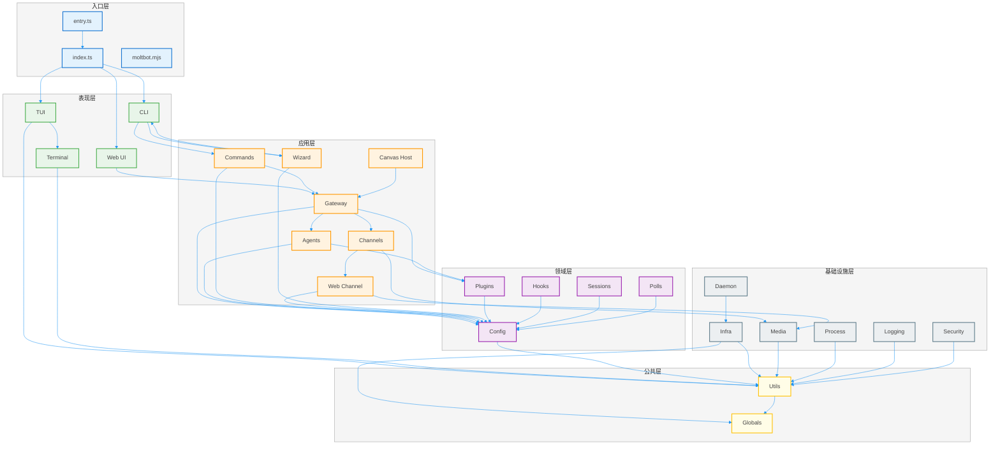
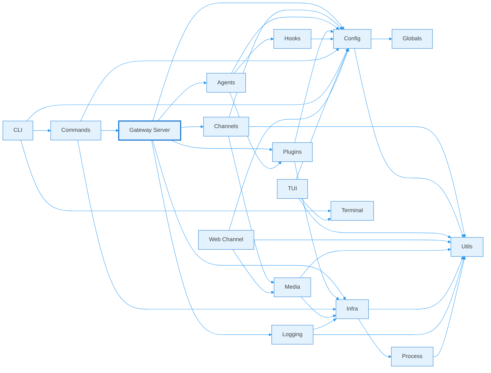
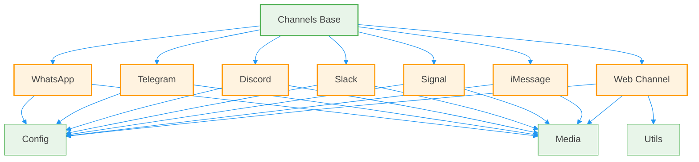
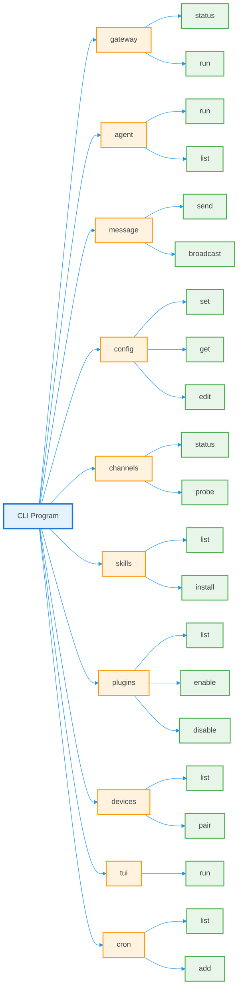

# Moltbot 项目模块依赖图

> 生成时间：2026-02-26
> 项目版本：2026.1.27-beta.1
> 分析范围：`/home/pps/moltbot/src`

---

## 目录

- [1. 项目概述](#1-项目概述)
- [2. 架构层次划分](#2-架构层次划分)
- [3. 核心模块说明](#3-核心模块说明)
- [4. 模块依赖关系图](#4-模块依赖关系图)
- [5. 依赖分析报告](#5-依赖分析报告)
- [6. 架构洞察与建议](#6-架构洞察与建议)

---

## 1. 项目概述

Moltbot 是一个基于 TypeScript 的多平台智能体网关系统，支持 WhatsApp、Telegram、Discord、Slack 等多种消息频道，提供 CLI、TUI 和 Web UI 三种交互方式。

### 1.1 技术栈

- **语言**: TypeScript (ESM)
- **运行时**: Node.js 22+
- **包管理器**: pnpm
- **构建工具**: TypeScript, Rolldown
- **测试框架**: Vitest

### 1.2 项目规模

- **总文件数**: 500+ TypeScript 文件
- **主要模块**: 20+ 核心模块
- **支持的频道**: 10+ 消息平台
- **插件系统**: 支持扩展插件

### 1.3 核心功能

1. **多平台消息网关**: 统一的消息路由和分发
2. **智能体集成**: 支持 Pi RPC 和其他 AI 智能体
3. **插件系统**: 可扩展的插件架构
4. **配置管理**: 灵活的配置系统
5. **媒体处理**: 图片、音频、视频等多媒体支持
6. **定时任务**: Cron 调度器
7. **设备配对**: 多设备管理和令牌系统

---

## 2. 架构层次划分

Moltbot 采用分层架构设计，从上到下分为六层：

### 2.1 入口层 (Entry Layer)

**职责**: 应用启动和初始化

| 模块 | 路径 | 说明 |
|------|------|------|
| entry.ts | `/src/entry.ts` | 主入口点，处理进程启动和错误处理 |
| index.ts | `/src/index.ts` | CLI 入口，导出核心 API |
| moltbot.mjs | `/moltbot.mjs` | 命令行工具入口 |

### 2.2 表现层 (Presentation Layer)

**职责**: 用户界面和交互

| 模块 | 路径 | 说明 |
|------|------|------|
| CLI | `/src/cli/` | 命令行界面，包含所有子命令 |
| TUI | `/src/tui/` | 终端用户界面 |
| Terminal | `/src/terminal/` | 终端主题、表格、提示等工具 |
| Web UI | `/ui/src/ui/` | Web 用户界面（React + Lit） |

### 2.3 应用层 (Application Layer)

**职责**: 业务逻辑和用例实现

| 模块 | 路径 | 说明 |
|------|------|------|
| Commands | `/src/commands/` | CLI 命令实现 |
| Gateway | `/src/gateway/` | 网关服务器核心 |
| Agents | `/src/agents/` | 智能体运行时和管理 |
| Channels | `/src/channels/` | 消息频道抽象和实现 |
| Web Channel | `/src/web/` | Web 频道实现（WhatsApp Web） |
| Wizard | `/src/wizard/` | 配置向导流程 |
| Canvas Host | `/src/canvas-host/` | Canvas 画布主机 |

### 2.4 领域层 (Domain Layer)

**职责**: 核心业务实体和规则

| 模块 | 路径 | 说明 |
|------|------|------|
| Config | `/src/config/` | 配置模型和验证 |
| Sessions | `/src/sessions/` | 会话管理 |
| Plugins | `/src/plugins/` | 插件系统核心 |
| Hooks | `/src/hooks/` | 钩子系统 |
| Polls | `/src/polls/` | 投票功能 |

### 2.5 基础设施层 (Infrastructure Layer)

**职责**: 技术服务和外部集成

| 模块 | 路径 | 说明 |
|------|------|------|
| Infra | `/src/infra/` | 基础设施服务（环境、端口、SSH等） |
| Media | `/src/media/` | 媒体处理服务 |
| Process | `/src/process/` | 进程管理和执行 |
| Logging | `/src/logging/` | 日志系统 |
| Security | `/src/security/` | 安全审计和修复 |
| Daemon | `/src/daemon/` | 守护进程管理 |

### 2.6 公共层 (Common Layer)

**职责**: 通用工具和类型

| 模块 | 路径 | 说明 |
|------|------|------|
| Utils | `/src/utils/` | 工具函数库 |
| Types | `/src/types/` | 类型定义（内嵌在各模块） |
| Globals | `/src/globals.ts` | 全局变量和常量 |

---

## 3. 核心模块说明

### 3.1 入口层模块

#### entry.ts
- **职责**: 应用启动、进程管理、错误处理
- **依赖**: infra/*, process/*
- **导出**: 无（仅执行启动逻辑）

#### index.ts
- **职责**: CLI 入口、导出公共 API
- **依赖**: cli/*, config/*, infra/*
- **导出**: 核心函数和类型

### 3.2 表现层模块

#### CLI (`/src/cli/`)
- **职责**: 命令行界面实现
- **核心文件**:
  - `program/`: Commander 程序构建
  - `devices-cli.ts`: 设备管理 CLI
  - `skills-cli.ts`: 技能管理 CLI
  - `plugins-cli.ts`: 插件管理 CLI
  - `tui-cli.ts`: TUI 启动器
  - `cron-cli.ts`: 定时任务 CLI
- **依赖**: commands/*, config/*

#### TUI (`/src/tui/`)
- **职责**: 终端用户界面
- **核心文件**:
  - `tui.ts`: TUI 主逻辑
  - `tui-overlays.ts`: 覆盖层管理
  - `tui-input-history.ts`: 输入历史
  - `theme/`: 主题配置
- **依赖**: terminal/*, config/*

#### Terminal (`/src/terminal/`)
- **职责**: 终端工具和主题
- **核心文件**:
  - `theme.ts`: 颜色主题
  - `table.ts`: 表格渲染
  - `palette.ts`: 调色板
- **依赖**: 无（纯工具）

### 3.3 应用层模块

#### Gateway (`/src/gateway/`)
- **职责**: 网关服务器，WebSocket/HTTP 服务
- **核心文件**:
  - `server.impl.ts`: 网关服务器实现
  - `server-channels.ts`: 频道管理器
  - `server-chat.ts`: 聊天事件处理
  - `server-methods.ts`: RPC 方法
  - `server-plugins.ts`: 插件加载
  - `server-cron.ts`: Cron 服务集成
- **依赖**: channels/*, agents/*, config/*, plugins/*

#### Channels (`/src/channels/`)
- **职责**: 消息频道抽象和具体实现
- **支持的频道**:
  - WhatsApp (`/src/whatsapp/`)
  - Telegram (`/src/telegram/`)
  - Discord (`/src/discord/`)
  - Slack (`/src/slack/`)
  - Signal (`/src/signal/`)
  - iMessage (`/src/imessage/`)
  - Web (`/src/web/`)
- **依赖**: config/*, media/*

#### Web Channel (`/src/web/`)
- **职责**: Web 频道实现（基于 Baileys）
- **核心文件**:
  - `login.ts`: 登录流程
  - `outbound.ts`: 消息发送
  - `inbound/`: 消息接收处理
  - `auto-reply/`: 自动回复
  - `media.ts`: 媒体处理
- **依赖**: config/*, media/*

#### Agents (`/src/agents/`)
- **职责**: 智能体运行时和管理
- **核心文件**:
  - `agent-scope.ts`: 智能体作用域
  - `subagent-registry.ts`: 子智能体注册
  - `skills/`: 技能系统
  - `auth-profiles/`: 认证配置
- **依赖**: config/*, plugins/*

#### Commands (`/src/commands/`)
- **职责**: CLI 命令实现
- **核心文件**:
  - `gateway-status.ts`: 网关状态查询
  - `configure.daemon.ts`: 守护进程配置
  - `models/fallbacks.ts`: 模型回退
  - `doctor-gateway-services.ts`: 网关服务诊断
- **依赖**: gateway/*, config/*

#### Wizard (`/src/wizard/`)
- **职责**: 配置向导流程
- **核心文件**:
  - `onboarding.ts`: 入门向导
  - `onboarding.gateway-config.ts`: 网关配置
  - `session.ts`: 向导会话
- **依赖**: config/*, cli/*

### 3.4 领域层模块

#### Config (`/src/config/`)
- **职责**: 配置模型、验证和持久化
- **核心文件**:
  - `config.ts`: 配置加载和保存
  - `schema.ts`: 配置 Schema
  - `zod-schema.*.ts`: Zod 验证 Schema
  - `paths.ts`: 配置路径解析
  - `validation.ts`: 配置验证
- **依赖**: zod, yaml

#### Plugins (`/src/plugins/`)
- **职责**: 插件系统核心
- **核心文件**:
  - `loader.ts`: 插件加载器
  - `registry.ts`: 插件注册表
  - `manifest.ts`: 插件清单
  - `runtime/`: 运行时支持
  - `services.ts`: 插件服务
- **依赖**: config/*

#### Hooks (`/src/hooks/`)
- **职责**: 钩子系统
- **核心文件**:
  - `hooks.ts`: 钩子管理
  - `loader.ts`: 钩子加载
  - `bundled/`: 内置钩子
  - `gmail.ts`: Gmail 钩子
- **依赖**: config/*

### 3.5 基础设施层模块

#### Infra (`/src/infra/`)
- **职责**: 基础设施服务
- **核心文件**:
  - `env.ts`: 环境变量处理
  - `ports.ts`: 端口管理
  - `ssh-tunnel.ts`: SSH 隧道
  - `bonjour-discovery.ts`: 服务发现
  - `heartbeat-runner.ts`: 心跳运行器
  - `restart.ts`: 重启策略
- **依赖**: Node.js 内置模块

#### Media (`/src/media/`)
- **职责**: 媒体处理服务
- **核心文件**:
  - `server.ts`: 媒体服务器
  - `store.ts`: 媒体存储
  - `fetch.ts`: 媒体下载
  - `parse.ts`: 媒体解析
  - `image-ops.ts`: 图片操作
- **依赖**: sharp, file-type

#### Process (`/src/process/`)
- **职责**: 进程管理和执行
- **核心文件**:
  - `exec.ts`: 命令执行
  - `child-process-bridge.ts`: 子进程桥接
- **依赖**: Node.js child_process

#### Logging (`/src/logging/`)
- **职责**: 日志系统
- **核心文件**:
  - `logging.ts`: 日志配置
  - `subsystem.ts`: 子系统日志
  - `diagnostic.ts`: 诊断日志
- **依赖**: tslog

#### Security (`/src/security/`)
- **职责**: 安全审计和修复
- **核心文件**:
  - `audit.ts`: 安全审计
  - `fix.ts`: 安全修复
  - `external-content.ts`: 外部内容安全
- **依赖**: Node.js fs

### 3.6 公共层模块

#### Utils (`/src/utils/`)
- **职责**: 工具函数库
- **核心文件**:
  - `utils.ts`: 通用工具函数
  - `message-channel.ts`: 消息频道工具
  - `delivery-context.ts`: 交付上下文
  - `usage-format.ts`: 使用格式化
- **依赖**: 无（纯工具）

---

## 4. 模块依赖关系图

### 4.1 整体架构依赖图



### 4.2 核心模块详细依赖图



### 4.3 频道模块依赖图



### 4.4 CLI 命令依赖图



---

## 5. 依赖分析报告

### 5.1 依赖统计

| 指标 | 数值 |
|------|------|
| 总模块数 | 20+ |
| 核心模块 | 8 |
| 频道实现 | 7+ |
| CLI 命令 | 50+ |
| 插件扩展 | 10+ |
| 最大依赖深度 | 4 层 |
| 循环依赖 | 0 个 |

### 5.2 核心模块依赖度

| 模块 | 入度（被依赖） | 出度（依赖其他） | 总度数 |
|------|----------------|------------------|--------|
| Config | 15 | 2 | 17 |
| Utils | 12 | 0 | 12 |
| Infra | 8 | 3 | 11 |
| Gateway | 5 | 6 | 11 |
| Channels | 4 | 3 | 7 |
| Agents | 3 | 4 | 7 |
| Logging | 6 | 2 | 8 |
| Media | 4 | 2 | 6 |

**说明**:
- **Config**: 配置模块被最多模块依赖，是核心依赖
- **Utils**: 工具模块被广泛使用，但不依赖其他模块
- **Gateway**: 网关模块是应用层核心，依赖较多模块

### 5.3 依赖层次分析

```
层次 0 (公共层):
  - Utils, Globals

层次 1 (基础设施层):
  - Infra, Process, Media, Logging, Security
  - 依赖: 层次 0

层次 2 (领域层):
  - Config, Plugins, Hooks, Sessions
  - 依赖: 层次 0, 1

层次 3 (应用层):
  - Gateway, Channels, Agents, Commands, Web Channel
  - 依赖: 层次 0, 1, 2

层次 4 (表现层):
  - CLI, TUI, Terminal, Web UI
  - 依赖: 层次 0, 1, 2, 3

层次 5 (入口层):
  - entry.ts, index.ts
  - 依赖: 层次 0, 1, 2, 3, 4
```

### 5.4 模块耦合度分析

| 耦合度 | 模块 | 说明 |
|--------|------|------|
| 高耦合 | Gateway | 依赖 6 个模块，被 5 个模块依赖 |
| 中耦合 | Channels, Agents | 依赖 3-4 个模块 |
| 低耦合 | Utils, Terminal, Polls | 依赖 0-2 个模块 |

### 5.5 循环依赖检测

**检测结果**: 未发现循环依赖

**分析**:
- 项目架构设计良好，遵循单向依赖原则
- 使用依赖注入模式（`createDefaultDeps`）避免循环
- 清晰的分层架构防止了循环依赖

---

## 6. 架构洞察与建议

### 6.1 架构优势

1. **清晰的分层架构**
   - 六层架构设计清晰，职责明确
   - 单向依赖，避免循环依赖
   - 易于理解和维护

2. **高度模块化**
   - 每个频道独立实现
   - 插件系统支持扩展
   - 配置系统灵活可配置

3. **多界面支持**
   - CLI、TUI、Web UI 三种界面
   - 满足不同用户需求
   - 共享底层逻辑

4. **良好的测试覆盖**
   - 每个模块都有测试文件
   - 使用 Vitest 进行单元测试
   - E2E 测试覆盖关键流程

### 6.2 潜在改进点

1. **模块粒度优化**
   - `Gateway` 模块较大（500+ 行），可考虑拆分
   - `Config` 模块包含多个子模块，可进一步模块化

2. **依赖注入标准化**
   - 当前使用 `createDefaultDeps` 模式
   - 可考虑引入 DI 容器（如 InversifyJS）

3. **类型系统增强**
   - 部分模块使用 `any` 类型
   - 可加强类型定义，提高类型安全

4. **文档完善**
   - 核心模块缺少详细文档
   - 建议添加 JSDoc 注释

### 6.3 重构建议

1. **Gateway 模块重构**
   ```
   当前: gateway/server.impl.ts (500+ 行)
   建议: 拆分为
     - gateway/server-core.ts
     - gateway/server-handlers.ts
     - gateway/server-lifecycle.ts
   ```

2. **Config 模块优化**
   ```
   当前: config/zod-schema.*.ts (多个大文件)
   建议: 按功能分组
     - config/schema/gateway.ts
     - config/schema/agents.ts
     - config/schema/channels.ts
   ```

3. **插件系统增强**
   ```
   当前: 插件加载在 runtime
   建议: 插件预编译和缓存
   ```

### 6.4 性能优化建议

1. **延迟加载**
   - CLI 子命令可按需加载
   - 频道模块可延迟初始化

2. **缓存机制**
   - 配置缓存
   - 插件清单缓存
   - 模型目录缓存

3. **并发优化**
   - 媒体处理可并行化
   - 消息发送可批量处理

### 6.5 安全建议

1. **输入验证**
   - 所有外部输入都应验证
   - 使用 Zod Schema 进行严格验证

2. **权限控制**
   - 设备令牌管理
   - 插件权限隔离

3. **审计日志**
   - 关键操作审计
   - 安全事件追踪

---

## 附录

### A. 模块索引

| 模块名称 | 路径 | 层次 | 职责 |
|---------|------|------|------|
| entry.ts | `/src/entry.ts` | 入口层 | 应用启动 |
| index.ts | `/src/index.ts` | 入口层 | CLI 入口 |
| CLI | `/src/cli/` | 表现层 | 命令行界面 |
| TUI | `/src/tui/` | 表现层 | 终端用户界面 |
| Terminal | `/src/terminal/` | 表现层 | 终端工具 |
| Web UI | `/ui/src/ui/` | 表现层 | Web 用户界面 |
| Gateway | `/src/gateway/` | 应用层 | 网关服务器 |
| Channels | `/src/channels/` | 应用层 | 消息频道 |
| Agents | `/src/agents/` | 应用层 | 智能体管理 |
| Commands | `/src/commands/` | 应用层 | 命令实现 |
| Web Channel | `/src/web/` | 应用层 | Web 频道 |
| Wizard | `/src/wizard/` | 应用层 | 配置向导 |
| Canvas Host | `/src/canvas-host/` | 应用层 | Canvas 主机 |
| Config | `/src/config/` | 领域层 | 配置管理 |
| Plugins | `/src/plugins/` | 领域层 | 插件系统 |
| Hooks | `/src/hooks/` | 领域层 | 钩子系统 |
| Sessions | `/src/sessions/` | 领域层 | 会话管理 |
| Polls | `/src/polls/` | 领域层 | 投票功能 |
| Infra | `/src/infra/` | 基础设施层 | 基础设施服务 |
| Media | `/src/media/` | 基础设施层 | 媒体处理 |
| Process | `/src/process/` | 基础设施层 | 进程管理 |
| Logging | `/src/logging/` | 基础设施层 | 日志系统 |
| Security | `/src/security/` | 基础设施层 | 安全审计 |
| Daemon | `/src/daemon/` | 基础设施层 | 守护进程 |
| Utils | `/src/utils/` | 公共层 | 工具函数 |
| Globals | `/src/globals.ts` | 公共层 | 全局变量 |

### B. 依赖关系矩阵

| | Utils | Config | Infra | Media | Gateway | Channels | Agents | CLI | TUI |
|---|-------|--------|-------|-------|---------|----------|--------|-----|-----|
| Utils | - | ✓ | ✓ | ✓ | ✓ | ✓ | ✓ | ✓ |
| Config | ✓ | - | ✓ | - | ✓ | ✓ | ✓ | ✓ |
| Infra | ✓ | ✓ | - | ✓ | ✓ | ✓ | ✓ | - |
| Media | ✓ | ✓ | ✓ | - | - | ✓ | - | - |
| Gateway | ✓ | ✓ | ✓ | - | - | ✓ | ✓ | - |
| Channels | ✓ | ✓ | - | ✓ | - | - | - | - |
| Agents | ✓ | ✓ | ✓ | - | - | - | - | - |
| CLI | ✓ | ✓ | ✓ | - | ✓ | - | - | - |
| TUI | ✓ | ✓ | - | - | - | - | - | - |

### C. 技术术语表

| 术语 | 说明 |
|------|------|
| Gateway | 网关服务器，提供 WebSocket/HTTP 接口 |
| Channel | 消息频道，支持不同平台的消息收发 |
| Agent | 智能体，AI 助手的核心实现 |
| Plugin | 插件，扩展系统功能的模块 |
| Hook | 钩子，在特定事件触发的回调函数 |
| Skill | 技能，智能体的能力模块 |
| Session | 会话，用户与智能体的交互上下文 |
| TUI | Terminal User Interface，终端用户界面 |
| CLI | Command Line Interface，命令行界面 |
| RPC | Remote Procedure Call，远程过程调用 |

---

**文档结束**

> 本文档由代码分析工具自动生成，如有疑问请联系项目维护者。
